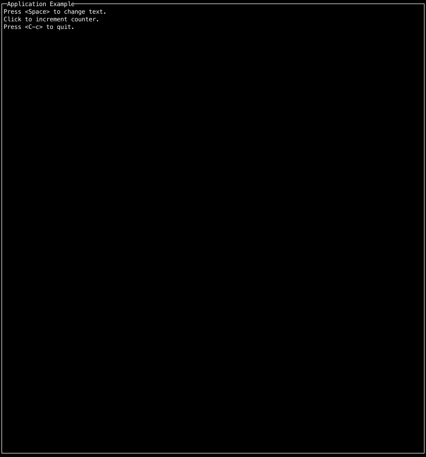

# Application Example
This example demonstrates the **Application** widget/feature.
## 🚀 Run
```bash
go run _examples/application/main.go
```
## 📸 Screenshot

## 📝 Code
See [main.go](main.go) for the implementation.
