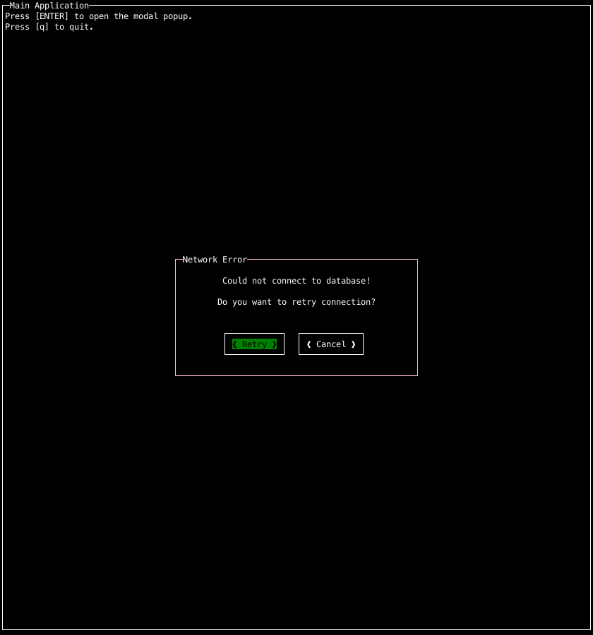

# Modal Example

This example demonstrates the **Modal** widget/feature.

## 🚀 Run

```bash
go run _examples/modal/main.go
```

## 📸 Screenshot



## 📝 Code

See [main.go](main.go) for the implementation.
